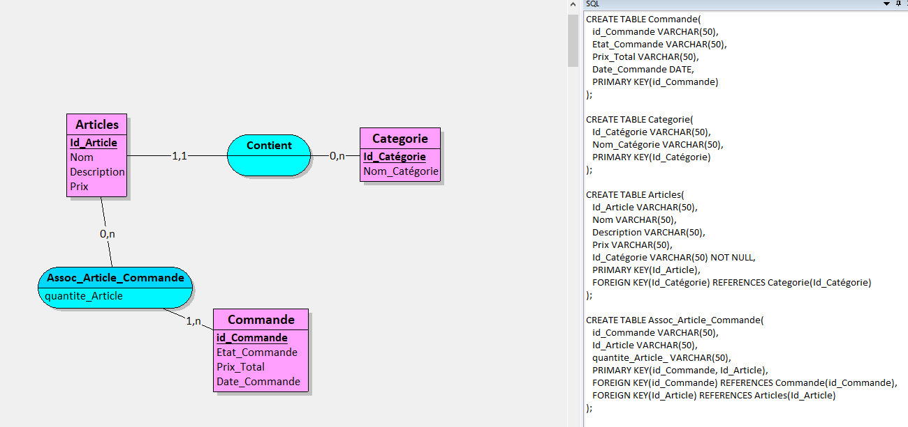

# **Projet : EatSmart**

**Etudiant :** Myriam

---

### **1. Description du projet**

Eatsmart est une application qui permet de consulter le menu de la pizzeria et de passer commande directement depuis celle-ci. Elle gère également le traitement des commandes et garde l'historique des commandes. Elle prévient directement le client lorsque sa commande est terminer.

---

### **3. Fonctionnalités principales**

#### **3.1 Frontend (eatSmartFront)**

- **Fonctionnalité 1 :**  
 Affichage dinamique du meenu de la pizzeria, permettant de aux utilisateurs de naviguer facilement entre les différentes catégories de plats(pizza,boissons,desserts, etc..) Chaque plats est accompagné de détails comme la description, les ingrédients et le prix.
  
- **Fonctionnalité 2 :**  
  Processus de commande simplifié, ou l'utilisateur peut sélectionner les plats qu'il souhaite commander, personnalisersa commande (choix de garniture,taille,etc..),puis ajouter au panier avant de procéder au paiement.
  
#### **3.2 Backend (eatSmartBack)**

- **Fonctionnalité 1 :**  
  Gestion des commandes en temps réel, avec un tableau de bord permettant aux administrateurs de suivre l'état des commandes et de gérer le clients.
  
- **Fonctionnalité 2 :**  
  Administration du menu, permettant d'ajouter, modifier ou supprimer des plats dans le menu de la pizzeria. Les prix,descriptions et ingrédients sont également mis à jour à partir de cette interface.

---

### **4. Technologies utilisées**

- **Frontend :** HTML, CSS, JavaScript
- **Backend :** API
- **Base de données :** MYSQL

---
### **5. MCD**

